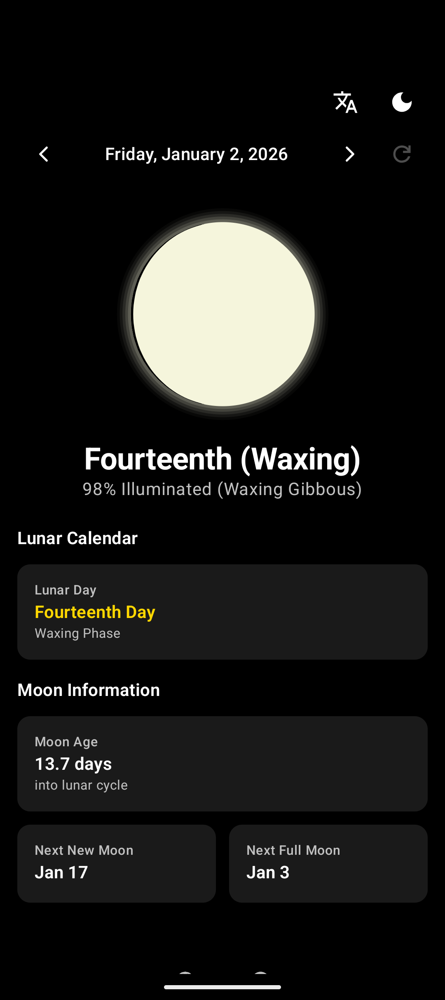
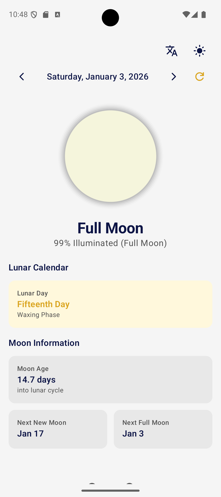

# Moon Phase

An Android companion app for [moon-phase](https://github.com/sreevardhanreddi/moon-phase) web application.

Displays moon phases with Hindu lunar calendar (Tithi/Paksha) integration and home screen widgets.

> **Note:** Moon phase calculations are **approximations** based on the synodic month cycle. They may differ by ±1 day from precise astronomical calculations. For religious observances, please consult a traditional Panchang or local calendar.

## Screenshots

<p align="center">
  
  &nbsp;&nbsp;
  
</p>

## Features

- **Moon Phase Visualization** - Approximate moon phase rendering with shadow
- **Hindu Lunar Calendar** - Tithi, Paksha (Shukla/Krishna), and special days (approximate)
- **Date Picker** - View moon phases for any date
- **Theme Support** - System, Light, and Dark (AMOLED) themes
- **Language Toggle** - Switch between English and Hindu terminology
- **Home Screen Widgets** - 6 sizes (1x1, 2x1, 3x1, 4x1, 2x2, 4x2)

## Widgets

| Size | Content                                |
| ---- | -------------------------------------- |
| 1x1  | Moon icon + tithi number               |
| 2x1  | Moon + tithi + moon age                |
| 3x1  | Moon + tithi + illumination %          |
| 4x1  | Moon + tithi + illumination + phase    |
| 2x2  | Moon + tithi + illumination + moon age |
| 4x2  | Full info + next new/full moon dates   |

## Tech Stack

- Kotlin
- Jetpack Compose
- Glance (Compose widgets)
- Material 3

## Build

Open in Android Studio and run on device/emulator.

```bash
./gradlew assembleDebug
```

## Download

Download the latest APK from [GitHub Releases](https://github.com/sreevardhanreddi/moon-phase-android/releases).

### Installation

1. Download `moon-phase-vX.X.X.apk` from the releases page
2. Enable "Install from unknown sources" in your Android settings
3. Open the APK file to install

## CI/CD

This project uses GitHub Actions for automated builds and releases.

| Workflow      | Trigger         | Description                                       |
| ------------- | --------------- | ------------------------------------------------- |
| `build.yml`   | Push/PR to main | Builds debug APK                                  |
| `release.yml` | Tag `v*`        | Builds signed release APK, creates GitHub release |

### Creating a Release

```bash
git tag v1.0.0
git push origin v1.0.0
```

The workflow will automatically build and publish the APK to GitHub Releases.

## License

MIT
